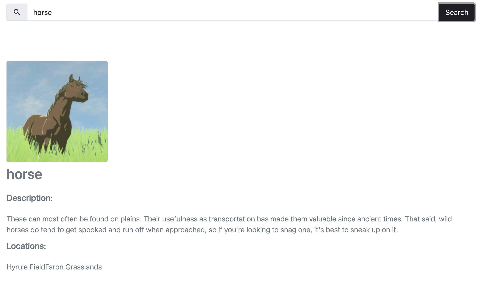

# Hyrule Encyclopedia

  

 
This project is an encyclopedy of Hyrule of Breath of The Wild.
You can search for anything you want in these five categories:

* Creatures
* Mosters
* Equipment
* Materials
* Treasures

## Technology

This project is styled with React Bootstrap and uses api of Hyrule Compendium.The documentation is available in https://gadhagod.github.io/Hyrule-Compendium-API/#/

## How do you run this project?

After cloning on github, in the project directory, you can run:

### `npm start`

Runs the app in the development mode.
Open [http://localhost:3000](http://localhost:3000) to view it in your browser.

